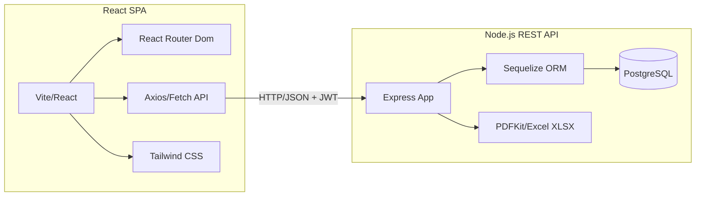
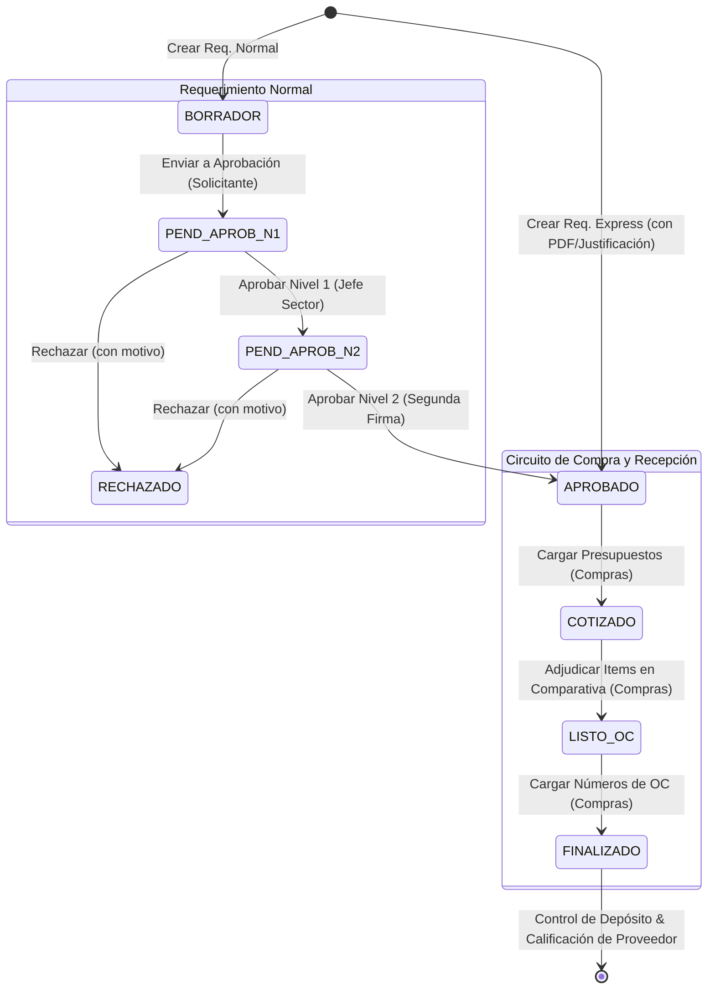

# Análisis del Sistema de Compras (Backend y Frontend)

Este documento detalla el análisis de la arquitectura, base de datos, flujos operativos, roles y seguridad de la aplicación **Sistema de Compras**.

---

## 1. Arquitectura General y Tecnologías

El sistema está estructurado con una clara separación entre el backend (API REST) y el frontend (SPA Dashboard).



### Backend (`compras-backend-node-master`)
- **Core**: Node.js con [Express.js](file:///C:/Users/German%20A.%20IT/Documents/Sistemas%20Compras/compras-backend-node-master/package.json#L20) (v5.2.1).
- **ORM**: [Sequelize](file:///C:/Users/German%20A.%20IT/Documents/Sistemas%20Compras/compras-backend-node-master/package.json#L26) (v6.37.7) para interacción con la base de datos PostgreSQL.
- **Base de Datos**: PostgreSQL mediante la librería [pg](file:///C:/Users/German%20A.%20IT/Documents/Sistemas%20Compras/compras-backend-node-master/package.json#L24) (v8.20.0).
- **Seguridad / Auth**: [bcryptjs](file:///C:/Users/German%20A.%20IT/Documents/Sistemas%20Compras/compras-backend-node-master/package.json#L17) para encriptación de contraseñas y [jsonwebtoken](file:///C:/Users/German%20A.%20IT/Documents/Sistemas%20Compras/compras-backend-node-master/package.json#L21) para autenticación basada en tokens JWT.
- **Manejo de Archivos**: [multer](file:///C:/Users/German%20A.%20IT/Documents/Sistemas%20Compras/compras-backend-node-master/package.json#L22) para subida de presupuestos en PDF y documentación de compras express.
- **Reportes / Exportación**: [pdfkit](file:///C:/Users/German%20A.%20IT/Documents/Sistemas%20Compras/compras-backend-node-master/package.json#L23) para la generación dinámica de PDFs de Órdenes de Compra y [xlsx](file:///C:/Users/German%20A.%20IT/Documents/Sistemas%20Compras/compras-backend-node-master/package.json#L27) para manipulación de planillas Excel.

### Frontend (`sistemacompras_frontend-main`)
- **Core**: React 18.2 con Vite como empaquetador rápido.
- **Rutas**: React Router Dom v6.14.1 para enrutamiento protegido de vistas.
- **Estilos**: Tailwind CSS v3.3.2 para una interfaz de usuario responsiva.
- **Cliente HTTP**: Axios v1.13.2 y Fetch API nativa adaptada para requests autenticados con JWT.

---

## 2. Estructura de Base de Datos y Modelos (Sequelize)

El modelo de datos gira en torno a los requerimientos de compra y su proceso de cotización y adjudicación. Las relaciones están configuradas en [models/index.js](file:///C:/Users/German%20A.%20IT/Documents/Sistemas%20Compras/compras-backend-node-master/src/models/index.js):

| Modelo | Tabla Física | Descripción / Rol en el sistema |
| :--- | :--- | :--- |
| **User** | `users` | Usuarios con credenciales, rol específico y asignación a un Sector. |
| **Sector** | `sectores` | Sectores organizacionales (ej: Sistemas, Administración, Ventas). |
| **CentroCosto** | `centros_costo` | Centros de costo contables asociados a un sector. |
| **Planta** | `plantas` | Ubicaciones físicas/plantas (ej: Campo). |
| **Requerimiento** | `requerimientos` | Solicitud de compra creada por un Solicitante (`USER`). |
| **RequerimientoItem** | `requerimiento_items` | Productos o servicios detallados dentro de un requerimiento. |
| **RequerimientoHistorial** | `requerimiento_historiales` | Bitácora automática de cambios de estado y motivos de rechazo. |
| **Proveedor** | `proveedores` | Directorio de proveedores para cotizar. |
| **CondicionPago** | `condiciones_pago` | Modalidades de pago configurables (Contado, 30 días, etc.). |
| **Presupuesto** | `presupuestos` | Cotización de un proveedor vinculada a un requerimiento. Contiene archivo PDF adjunto. |
| **PresupuestoItem** | `presupuesto_items` | Detalle de precios unitarios ofertados por el proveedor para cada ítem del requerimiento. |
| **Adjudicacion** | `adjudicaciones` | Tabla pivote que registra qué oferta (`PresupuestoItem`) se seleccionó para cada ítem. |

---

## 3. Matriz de Roles y Permisos

El frontend utiliza una matriz declarativa de permisos en [utils/roles.js](file:///C:/Users/German%20A.%20IT/Documents/Sistemas%20Compras/sistemacompras_frontend-main/src/utils/roles.js) para habilitar páginas y acciones específicas según el rol del usuario autenticado:

### Roles del Sistema
1. **ADMIN** (Administrador): Tiene acceso total a todas las vistas, gestión de usuarios, auditoría y control total del circuito.
2. **USER** (Solicitante): Crea requerimientos de compra (Normales y Express) y realiza el seguimiento de sus propios requerimientos en borrador o aprobación.
3. **APROBADOR_N1** (Jefe de sector): Responsable de dar la primera firma de aprobación a requerimientos de su mismo sector.
4. **APROBADOR_N2** (Aprobador segunda firma): Responsable de dar la firma final a requerimientos antes de enviarlos a Compras.
5. **COMPRAS** (Comprador/Adjudicador): Carga presupuestos recibidos de proveedores, realiza comparativas de precios, adjudica ítems y asigna códigos de Órdenes de Compra (OC).
6. **DEPOSITO** (Receptor de mercadería): Controla la llegada de mercadería según las OCs asignadas, gestiona estados de recepción y califica a los proveedores.

### Matriz de Acciones Permitidas
```javascript
export const actionPermissions = {
  crearRequerimiento: ["ADMIN", "USER"],
  editarBorrador: ["ADMIN", "USER"],
  enviarAprobacion: ["ADMIN", "USER"],
  aprobarN1: ["ADMIN", "APROBADOR_N1"],
  aprobarN2: ["ADMIN"], // Aprobación de segunda firma
  gestionarCotizaciones: ["ADMIN", "COMPRAS"],
  adjudicarComparativa: ["ADMIN", "COMPRAS"],
  asignarOC: ["ADMIN", "COMPRAS"],
  seguimientoDeposito: ["ADMIN", "DEPOSITO"],
  administrarUsuarios: ["ADMIN"],
};
```

---

## 4. Circuito de Aprobación y Flujo de Estados

El estado de un requerimiento determina qué acciones se pueden realizar y qué rol debe intervenir. Las transiciones de estados principales están en [RequerimientoService.js](file:///C:/Users/German%20A.%20IT/Documents/Sistemas%20Compras/compras-backend-node-master/src/services/RequerimientoService.js):



### Reglas de Negocio Críticas en Aprobaciones:
- **Auto-aprobación bloqueada**: Un aprobador (N1 o N2) no puede aprobar un requerimiento creado por sí mismo, a menos que sea `ADMIN`.
- **Restricción de Sector**: Los aprobadores de nivel 1 sólo pueden aprobar requerimientos correspondientes a su propio sector (`sector_id`), impidiendo aprobar requerimientos ajenos.
- **Requerimiento Express**: Permite saltear el circuito de aprobación. Se le exige al solicitante una **justificación por escrito** y un **archivo/documentación adjunta** que valide la urgencia, quedando directamente en estado `APROBADO` para el área de Compras.

---

## 5. Módulos Operativos Destacados

### A. Planilla de Comparativa de Precios (`ComparativaPrecios.jsx`)
Es el núcleo del área de Compras.
- Renderiza una matriz dinámica que compara lado a lado las cotizaciones de los proveedores para cada ítem solicitado.
- Resalta automáticamente la oferta con **Menor precio** por ítem para asistir en la toma de decisiones.
- Permite la **Adjudicación por Ítem** (ej: comprar el ítem 1 al Proveedor A y el ítem 2 al Proveedor B).
- Calcula automáticamente los totales proyectados por proveedor y el total adjudicado definitivo.

### B. Gestión de Depósito y Recepción (`Deposito.jsx`)
Módulo exclusivo para el rol de `DEPOSITO` y `ADMIN`.
- Lista únicamente aquellos requerimientos en estado `FINALIZADO` (es decir, con números de Órdenes de Compra ya cargados por el comprador).
- Permite realizar seguimiento físico del pedido, marcándolo como **Pendiente**, **Parcial** (si falta mercadería) o **Recibido**.
- **Calificaciones de Proveedores**: Al confirmar la recepción final ("Recibido"), el sistema despliega un modal interactivo para evaluar al proveedor en 4 aspectos clave (Calificación General, Precio, Calidad y Rapidez de entrega), con almacenamiento local persistente para auditoría.

---

## 6. Configuración de Entornos y Despliegue

Ambos proyectos cuentan con soporte para contenedores mediante Docker:
- **Backend Dockerfile**: Configura un contenedor Node tradicional.
- **Frontend Dockerfile**: Configura una etapa de construcción (build) con Vite y sirve la SPA estática mediante Nginx.
- **docker-compose.yml**: Permite orquestar el backend, frontend y un servicio de base de datos PostgreSQL de forma local.
- **Render / Vercel**: Cuenta con plantillas de configuración (`render.yaml` y `vercel.json`) listas para despliegue en entornos cloud.
